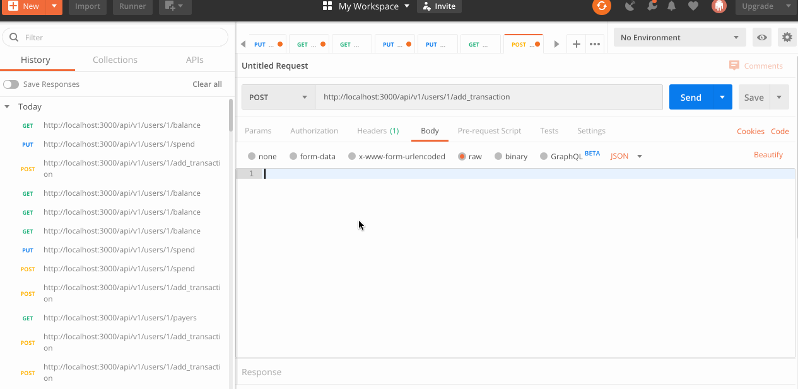
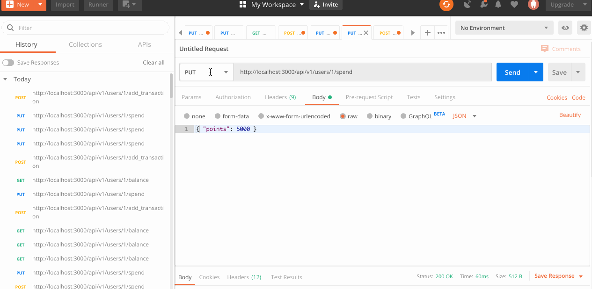
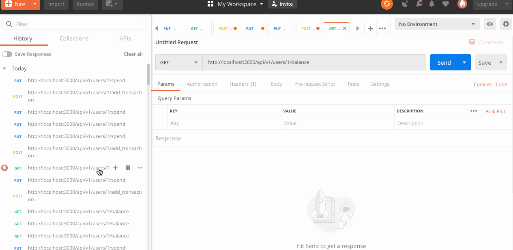
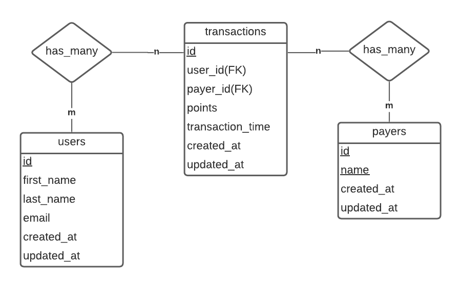

# README

### System dependencies

- Ruby 2.6.3
- Ruby on Rails 6.0.4.4
- Rspec 5.0.0
- Factory-bot Rails
- Faker
- Database: SqlLite3

Instructions to run locally
```
cd <Project Location>
rails s
```
Instructions to run with Docker
 ```
  docker-compose up --build
  http://localhost:3000/api/v1/users
 ```

Demo for the required routes and their results

1. add_transaction:
   - Url: http://localhost:3000/api/v1/users/1/add_transaction
   - http method: Post

   


2. spend:
  - Url:  http://localhost:3000/api/v1/users/1/spend
  - http method: Put

  

3. balance:
 - Url: http://localhost:3000/api/v1/users/1/balance
 - http method: Get

 

Database Design



 Instructions to run Tests
```
rspec spec
```